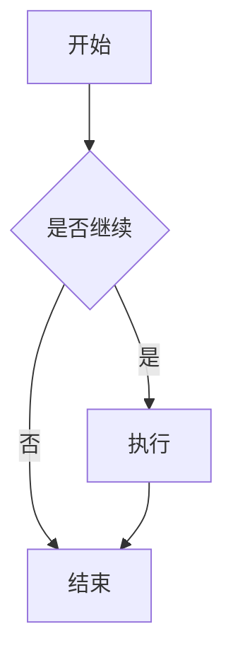
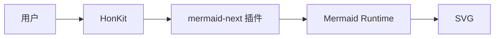
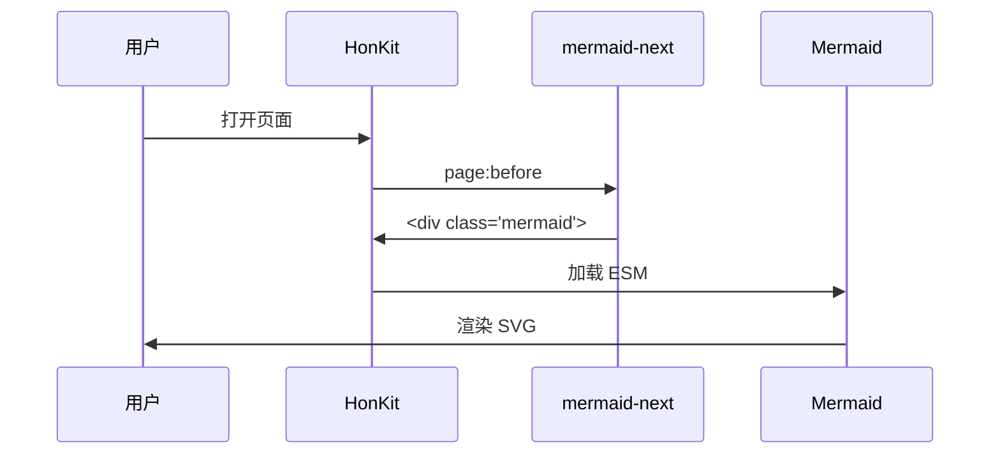
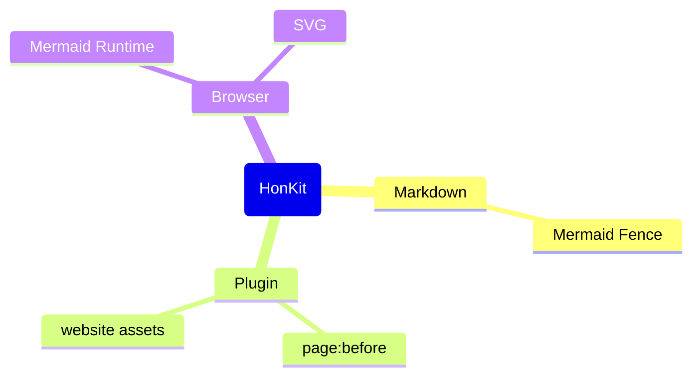
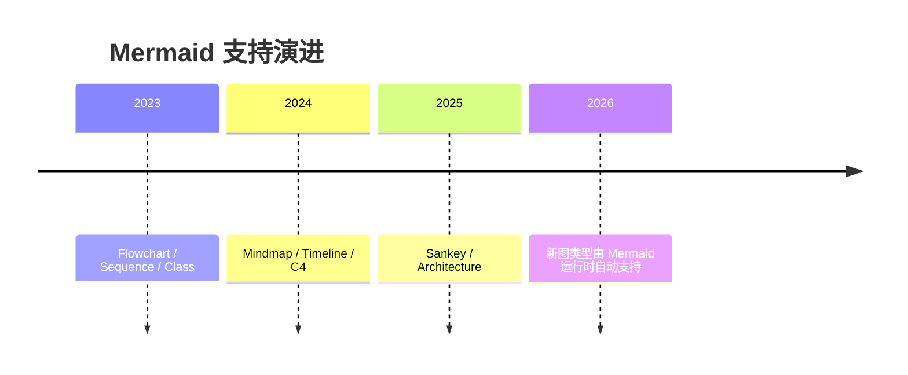
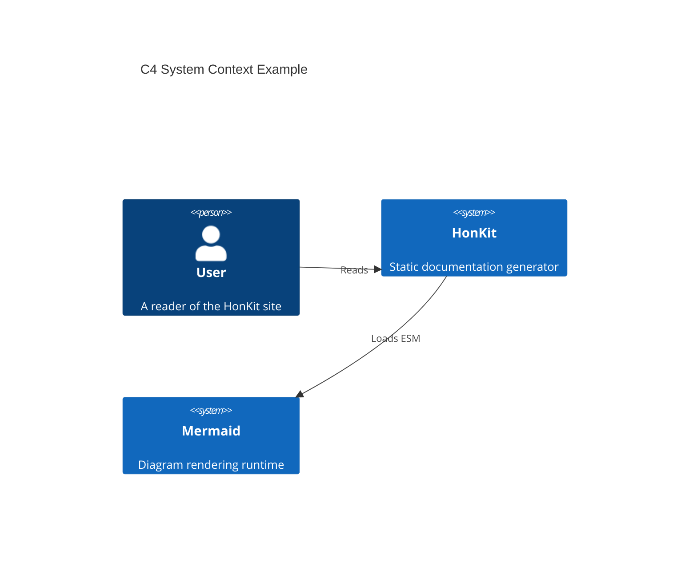
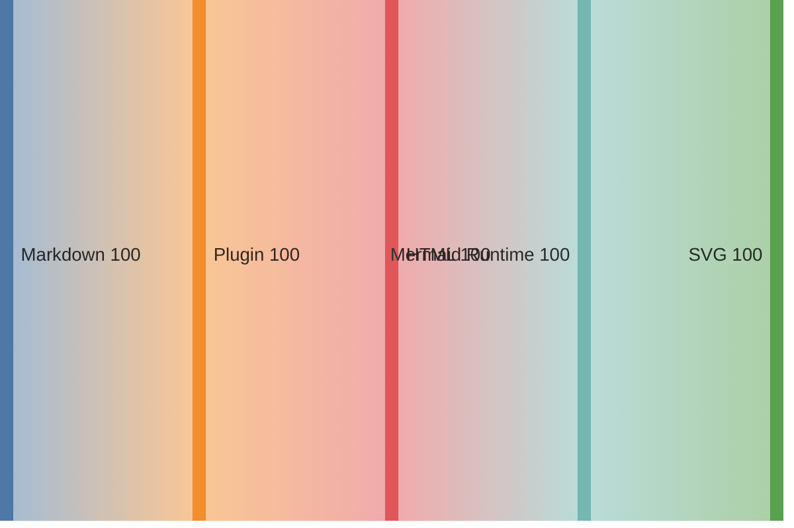
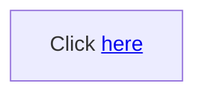

# honkit-plugin-mermaid-next

HonKit Mermaid 插件，用于在 HonKit 文档中原生支持 Mermaid 11.x/12.x 图表。

插件不会修改 HonKit 的 Markdown Parser，也不会绑定某个具体 Mermaid 图类型。它只做两件事：

1. 在 Markdown 阶段把 `mermaid` fenced code block 转成 `<div class="mermaid">...</div>`。
2. 在浏览器端加载 Mermaid ESM 运行时，由 Mermaid 官方库渲染 SVG。

这种方式和 VitePress、Docusaurus、MkDocs Material 等现代文档工具的 Mermaid 集成思路一致：插件只负责接入，图类型能力由 Mermaid 官方运行时提供。

## 特性

- 支持 Mermaid 11.x/12.x。
- 支持 Mermaid 官方所有图类型，例如：
  - Flowchart
  - Sequence Diagram
  - Class Diagram
  - State Diagram
  - Entity Relationship Diagram
  - User Journey
  - Gantt
  - Pie
  - GitGraph
  - Mindmap
  - Timeline
  - C4
  - Sankey
  - Architecture
  - Requirement
  - Packet
  - Quadrant
  - Kanban
- 默认从 CDN 加载 Mermaid ESM。
- 支持本地 Mermaid ESM 文件。
- 支持 `book.json` 配置透传。
- 支持自动暗黑模式。
- 支持 HonKit 页面切换后的自动重绘。
- 支持懒加载。
- 支持渲染错误提示。
- 不需要为新增 Mermaid 图类型升级插件代码，只需要升级 Mermaid 运行时版本。

## 安装

```bash
npm install honkit-plugin-mermaid-next
```

然后在 HonKit 的 `book.json` 中启用插件：

```json
{
  "plugins": ["mermaid-next"]
}
```

## 快速开始

在 Markdown 中直接使用 `mermaid` fenced code block：

````markdown

````

构建后，插件会将其转换为：

```html
<div class="mermaid" data-mermaid-next="true">
flowchart TD
  A[开始] --> B{是否继续}
  B -->|是| C[执行]
  B -->|否| D[结束]
  C --> D
</div>
```

页面加载后，浏览器端 Mermaid 运行时会把该节点渲染为 SVG。

## 基础配置

推荐配置：

```json
{
  "plugins": ["mermaid-next"],
  "pluginsConfig": {
    "mermaid-next": {
      "theme": "auto",
      "cdn": true,
      "mermaidVersion": "11",
      "lazy": false,
      "securityLevel": "loose"
    }
  }
}
```

## 配置项

| 配置项 | 默认值 | 类型 | 说明 |
| --- | --- | --- | --- |
| `theme` | `auto` | `string` | Mermaid 主题。支持 `default`、`dark`、`forest`、`neutral`、`neo`、`neo-dark`、`base`、`auto`。 |
| `cdn` | `true` | `boolean` | 是否从 CDN 加载 Mermaid ESM。 |
| `mermaidVersion` | `11` | `string` | 默认 CDN 使用的 Mermaid 主版本，例如 `11` 或 `12`。 |
| `mermaidCdn` | `""` | `string` | 自定义 Mermaid ESM URL。设置 `cdn: false` 时通常需要提供该值。 |
| `lazy` | `false` | `boolean` | 是否等图表进入视口后再渲染。 |
| `lazyMargin` | `200px` | `string` | 懒加载提前渲染距离，会传给 `IntersectionObserver.rootMargin` 的数值部分。 |
| `securityLevel` | `loose` | `string` | 传给 `mermaid.initialize` 的 `securityLevel`。可选值参考 Mermaid 官方文档。 |
| `escapeHtml` | `true` | `boolean` | 是否在插入 Mermaid 源码前转义 HTML。 |
| `errorRenderer` | `true` | `boolean` | 渲染失败时是否在页面中显示错误信息。 |
| `config` | `{}` | `object` | 透传给 `mermaid.initialize` 的额外 Mermaid 配置。 |

## 主题配置

### 固定主题

```json
{
  "pluginsConfig": {
    "mermaid-next": {
      "theme": "dark"
    }
  }
}
```

可选主题：

```json
[
  "default",
  "dark",
  "forest",
  "neutral",
  "neo",
  "neo-dark",
  "base"
]
```

### 自动暗黑模式

```json
{
  "pluginsConfig": {
    "mermaid-next": {
      "theme": "auto"
    }
  }
}
```

`theme: "auto"` 会根据 `window.matchMedia("(prefers-color-scheme: dark)")` 自动选择：

- 深色系统偏好：`dark`
- 浅色系统偏好：`default`

当系统主题变化时，插件会重新初始化 Mermaid 并重绘已渲染图表。

## CDN 配置

### 使用 Mermaid 11

```json
{
  "pluginsConfig": {
    "mermaid-next": {
      "cdn": true,
      "mermaidVersion": "11"
    }
  }
}
```

### 使用 Mermaid 12

当 Mermaid 12 发布并可用后，可以切换为：

```json
{
  "pluginsConfig": {
    "mermaid-next": {
      "cdn": true,
      "mermaidVersion": "12"
    }
  }
}
```

### 使用完整 Mermaid CDN URL

如果需要固定到具体版本，可以直接指定 `mermaidCdn`：

```json
{
  "pluginsConfig": {
    "mermaid-next": {
      "cdn": true,
      "mermaidCdn": "https://cdn.jsdelivr.net/npm/mermaid@11.12.0/dist/mermaid.esm.min.mjs"
    }
  }
}
```

## 本地加载 Mermaid

如果不想使用 CDN，可以自行准备 Mermaid ESM 文件，例如：

```text
book/
├── assets/
│   └── mermaid.esm.min.mjs
├── book.json
└── ...
```

然后配置：

```json
{
  "pluginsConfig": {
    "mermaid-next": {
      "cdn": false,
      "mermaidCdn": "/assets/mermaid.esm.min.mjs"
    }
  }
}
```

`mermaidCdn` 可以是绝对路径，也可以是相对路径：

```json
{
  "pluginsConfig": {
    "mermaid-next": {
      "cdn": false,
      "mermaidCdn": "assets/mermaid.esm.min.mjs"
    }
  }
}
```

## Mermaid 配置透传

所有 Mermaid 官方配置都可以放到 `config` 中：

```json
{
  "pluginsConfig": {
    "mermaid-next": {
      "theme": "default",
      "securityLevel": "loose",
      "config": {
        "logLevel": "warn",
        "flowchart": {
          "useMaxWidth": true,
          "htmlLabels": true
        },
        "sequence": {
          "diagramMarginX": 50,
          "diagramMarginY": 10
        },
        "gantt": {
          "titleTopMargin": 25
        }
      }
    }
  }
}
```

## 示例

### Flowchart

````markdown

````

### Sequence Diagram

````markdown

````

### Mindmap

````markdown

````

### Timeline

````markdown

````

### C4

````markdown

````

### Sankey

````markdown

````

### Architecture

````markdown

````

## HTML Label 注意事项

默认配置为：

```json
{
  "pluginsConfig": {
    "mermaid-next": {
      "escapeHtml": true,
      "securityLevel": "loose"
    }
  }
}
```

`escapeHtml: true` 可以防止 Mermaid 源码中的 HTML 被直接插入页面。

如果你的图表依赖 Mermaid 的 HTML label，例如：

````markdown

````

可以把 `escapeHtml` 关闭：

```json
{
  "pluginsConfig": {
    "mermaid-next": {
      "escapeHtml": false,
      "securityLevel": "loose"
    }
  }
}
```

关闭 HTML 转义后，请确保文档源码可信，避免插入不可信 HTML 或脚本。

## SPA / 页面切换

HonKit 网站模式可能会动态切换页面。插件会在以下场景自动重新扫描并渲染 Mermaid 节点：

- 页面首次加载。
- `window.load`。
- `pageshow`。
- `popstate`。
- `history.pushState`。
- `history.replaceState`。
- DOM 中出现新的 `.mermaid` 节点。
- `honkit:page:rendered` 事件。
- `gitbook:page:rendered` 事件。

因此不需要在每个页面中手动调用 Mermaid API。

## 懒加载

开启懒加载后，图表会在进入视口附近时渲染：

```json
{
  "pluginsConfig": {
    "mermaid-next": {
      "lazy": true,
      "lazyMargin": "300px"
    }
  }
}
```

如果浏览器不支持 `IntersectionObserver`，插件会退化为立即渲染。

## PDF / eBook 注意事项

HonKit 的 PDF/eBook 输出流程可能和普通网页不同。Mermaid 图表需要浏览器执行 JavaScript 才能渲染为 SVG。

如果遇到 PDF 中图表没有渲染的问题，可以尝试：

1. 确认 PDF 构建流程启用了浏览器执行 JavaScript。
2. 使用本地 Mermaid ESM 文件，避免 CDN 网络问题。
3. 关闭懒加载：

```json
{
  "pluginsConfig": {
    "mermaid-next": {
      "lazy": false
    }
  }
}
```

## 开发

安装依赖：

```bash
npm install
```

检查 Node 语法：

```bash
node --check index.js
node --check assets/mermaid-init.js
```

检查 npm 打包内容：

```bash
npm pack --dry-run
```

## 目录结构

```text
honkit-plugin-mermaid-next/
├── package.json
├── index.js
├── assets/
│   ├── mermaid-init.js
│   └── mermaid.css
└── README.md
```

## 许可证

MIT
