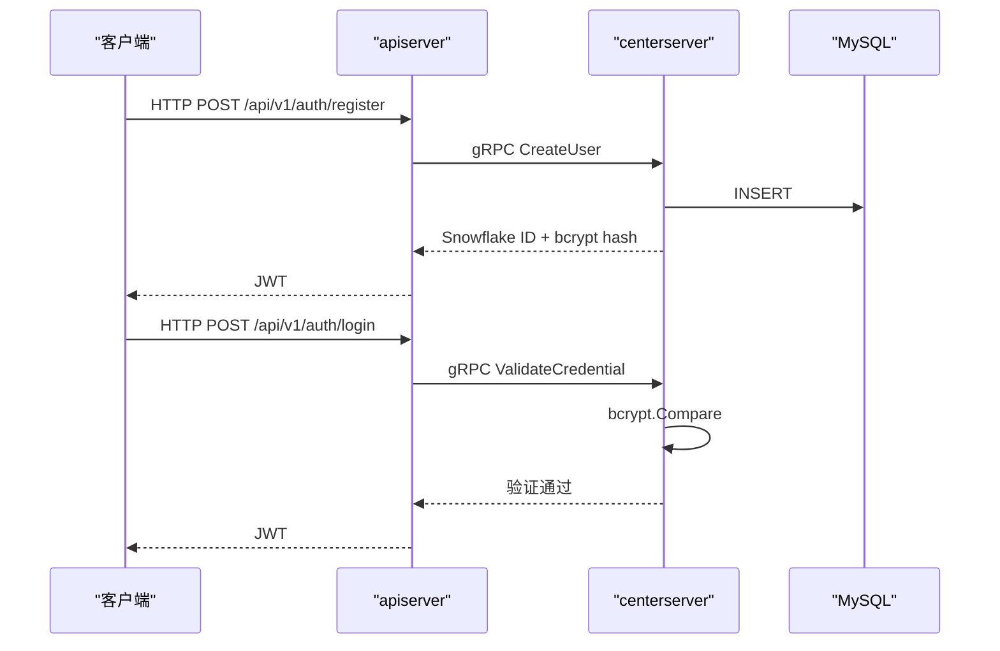

# Test Book

```mermaid
sequenceDiagram
    participant C as "客户端"
    participant A as "apiserver"
    participant CS as "centerserver"
    participant DB as "MySQL"

    C->>A: HTTP POST /api/v1/auth/register
    A->>CS: gRPC CreateUser
    CS->>DB: INSERT
    CS-->>A: Snowflake ID + bcrypt hash
    A-->>C: JWT

    C->>A: HTTP POST /api/v1/auth/login
    A->>CS: gRPC ValidateCredential
    CS->>CS: bcrypt.Compare
    CS-->>A: 验证通过
    A-->>C: JWT
```